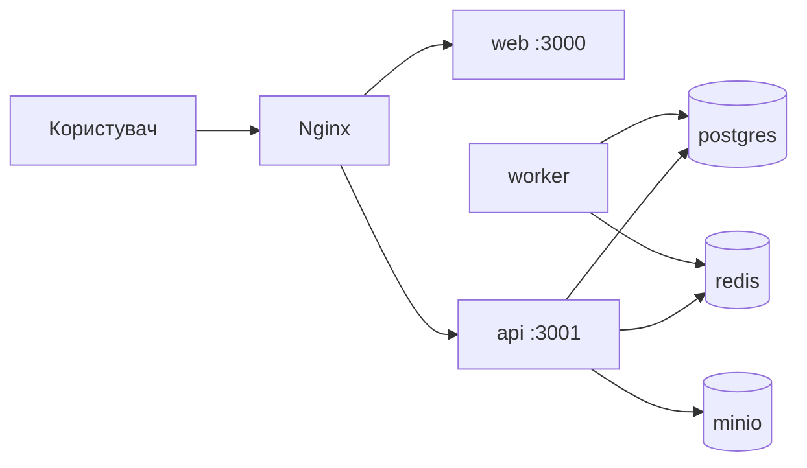

# 02. Архітектура

## Стек технологій

| Шар | Технологія |
|-----|------------|
| API | NestJS 11, Prisma 6, TypeScript |
| Web | Next.js 15, React 19, PWA |
| БД | PostgreSQL 16 |
| Кеш / черги | Redis 7, BullMQ (worker) |
| Файли | MinIO (S3 API) |
| Proxy | nginx |
| Shared | `packages/shared` — enums, labels |

## Структура monorepo

```
DAH/
├── apps/
│   ├── api/          # NestJS backend
│   │   ├── prisma/   # schema, migrations, seed
│   │   └── src/
│   │       ├── modules/   # доменні модулі
│   │       ├── common/    # guards, decorators, utils
│   │       └── prisma/
│   └── web/          # Next.js PWA
│       ├── src/app/       # App Router pages
│       ├── public/        # manifest, sw.js, icons
│       └── e2e/           # Playwright
├── packages/shared/
├── infra/
│   ├── nginx/
│   ├── scripts/      # backup, restore, setup-test-db
│   └── certs/        # TLS (production)
├── SPEC/             # ця документація
├── docs/             # операційні гайди
└── docker-compose.yml
```

## Docker-сервіси



| Сервіс | Порт (dev) | Призначення |
|--------|------------|-------------|
| nginx | 8080 | Reverse proxy |
| web | 3000 | Next.js |
| api | 3001 | REST API |
| postgres | 5432 | PostgreSQL |
| redis | 6379 | BullMQ |
| minio | 9000 / 9001 | S3 API / Console |

## Web UI shell

| Компонент | Шлях | Призначення |
|-----------|------|-------------|
| `AppShell` | `apps/web/src/components/AppShell.tsx` | Header, drawer, logout |
| `admin/layout.tsx` | `apps/web/src/app/admin/` | Обгортка admin-сторінок |
| `resident/layout.tsx` | `apps/web/src/app/resident/` | Обгортка кабінету мешканця |
| `lib/auth.ts` | `apps/web/src/lib/` | `logout()`, `getRoleHome()` |
| `lib/nav-config.ts` | `apps/web/src/lib/` | Пункти меню за роллю |
| `globals.css` | `.app-shell`, `.app-drawer`, `.nav-scroll` | Адаптивні стилі |

Layouts не використовують server-side auth (middleware вимкнено) — guard на клієнті через `getToken()`.

## Модулі API

| Модуль | Prefix | Відповідальність |
|--------|--------|------------------|
| auth | `/api/auth` | JWT, реєстрація, login, sessions |
| building | `/api/building` | Будинки (multi), квартири, налаштування |
| finance | `/api/finance` | Фонди, витрати, постачальники, звіти |
| accruals | `/api/accruals` | Нарахування, квитанції PDF, timeline |
| payments | `/api/payments` | Платежі, FIFO, боржники, online webhook |
| journal | `/api/journal` | Immutable ledger + reconcile |
| documents | `/api/documents` | Публічні документи ОСМД |
| transparency | `/api/transparency` | Дашборд прозорості |
| communications | `/api/communications` | Оголошення, заявки, опитування (вага/кворум) |
| notifications | `/api/notifications` | Web Push підписки |
| audit | `/api/audit` | Журнал аудиту |
| files | `/api/files` | Завантаження в MinIO |
| health | `/api/health` | Health check (DB/Redis/MinIO/backup) |

### Shared packages (v1.0)

| Package | Призначення |
|---------|-------------|
| `@dah/shared` | enums, permissions, labels |
| `@dah/money` | minor units arithmetic |
| `@dah/api-client` | shared TS API types |

### Multi-building

Один **tenant** (юридичне ОСББ) = **N будинків**. Клієнт передає `buildingId` (query/body); web switcher зберігає вибір у `localStorage`.

### Multi-tenant (v1.5+)

| Сутність | Поле |
|----------|------|
| `Tenant` | name, slug, isActive |
| `Building` | `tenantId` (обовʼязково) |
| `User` | `tenantId` (null = platform `super_admin`) |

JWT містить `tenantId`. Не-super_admin бачить лише свої buildings/apartments.  
`GET/POST /tenants` — лише super_admin (`/admin/tenants`).

## Ключові утиліти (бізнес-логіка)

Винесені в `apps/api/src/common/utils/` для unit-тестів:

- `money.ts` — округлення грошових сум
- `fifo-allocation.ts` — FIFO-розноска платежів
- `accrual-distribution.ts` — розрахунок нарахувань

## Аутентифікація

- Access token (JWT, 15 хв за замовчуванням)
- Refresh token (7 днів)
- Bearer header: `Authorization: Bearer <token>`
- Глобальний prefix API: `/api`

## Змінні середовища

Див. `.env.example`. Критичні для production:

- `JWT_SECRET`, `POSTGRES_PASSWORD`, `S3_SECRET_KEY`
- `DOMAIN`, `CORS_ORIGIN`, `NEXT_PUBLIC_API_URL`
- `VAPID_*` — для Web Push