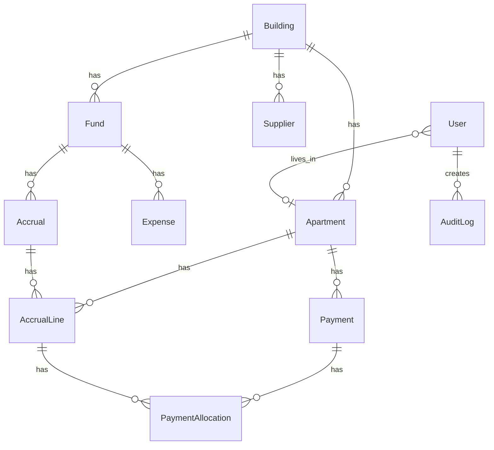

# 04. Модель даних

База: **PostgreSQL 16**, ORM: **Prisma**. Схема: `apps/api/prisma/schema.prisma`.

## Діаграма сутностей (спрощено)



## Основні сутності

### Building
Один запис на інстанс (single-tenant).

| Поле | Тип | Опис |
|------|-----|------|
| name | String | Назва ОСМД |
| address | String | Адреса |
| edrpou | String? | ЄДРПОУ |
| showDebtorsToResidents | Boolean | Показувати боржників мешканцям |

### Apartment
| Поле | Тип | Опис |
|------|-----|------|
| number | String | Номер квартири |
| entrance | Int | Під'їзд |
| floor | Int? | Поверх |
| area | Float | Площа, м² |

Унікальність: `(buildingId, number)`.

### Fund
| type | Опис |
|------|------|
| `maintenance` | Фонд утримання |
| `capital_repair` | Фонд капремонту |
| `special` | Спеціальний фонд |

`openingBalance` — початковий залишок на момент впровадження.

### Expense
Витрата з фонду. Підтримує soft-void через `isVoided` + `voidReason`. Опційно `documentKey` (MinIO).

### Accrual / AccrualLine
- **Accrual** — нарахування за період (`period`: `YYYY-MM`)
- **AccrualLine** — сума на квартиру

Статуси лінії (`AccrualLineStatus`):

| Статус | Опис |
|--------|------|
| `open` | Не сплачено |
| `partially_paid` | Частково |
| `paid` | Повністю |
| `overdue` | Прострочено |

### Payment / PaymentAllocation
Платіж прив'язаний до квартири. `PaymentAllocation` — розноска на `AccrualLine` (FIFO).

### Communications

| Модель | Опис |
|--------|------|
| Announcement | Оголошення (title, body, isPinned) |
| Request | Заявка мешканця (category, status) |
| Poll / PollOption / PollVote | Опитування; 1 голос на `(pollId, userId)` |

### AuditLog
Неізмінний журнал дій: `action`, `entityType`, `entityId`, `payload` (JSON).

Типові `action`:
- `auth.login`, `expense.created`, `expense.voided`
- `accrual.created`, `payment.created`, `payment.voided`
- `announcement.created`, `request.created`, `poll.created`
- `building.settings_updated`, `document.created`

### PushSubscription
Web Push endpoint + ключі (`p256dh`, `auth`) для користувача.

## Enums (довідник)

```
UserRole: chairman | accountant | board | resident | auditor
UserStatus: pending | active | blocked
FundType: maintenance | capital_repair | special
AccrualDistribution: by_area | fixed_per_apartment | manual
PaymentSource: bank | cash | transfer
RequestStatus: new | in_progress | done
```

## Міграції

```
apps/api/prisma/migrations/
├── 20260625121850_init
├── 20260625123336_building_settings
└── 20260625140000_push_subscription
```

Команди:
```bash
npm run db:migrate:dev -w @dah/api   # dev
npm run db:migrate -w @dah/api       # production deploy
```