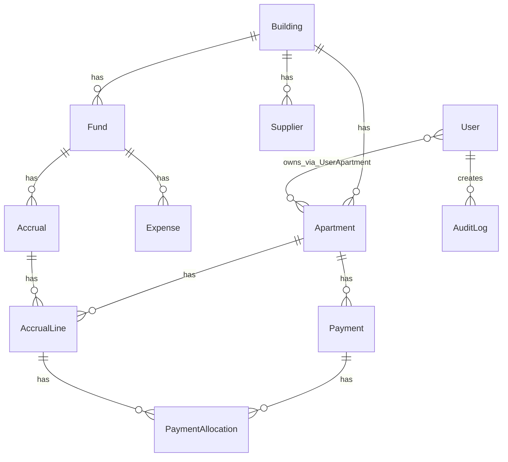

# 04. Модель даних

База: **PostgreSQL 16**, ORM: **Prisma**. Схема: `apps/api/prisma/schema.prisma`.

## Діаграма сутностей (спрощено)



## Основні сутності

### Tenant
Одна **організація** (ОСББ або УК) на спільному інстансі.

| Поле | Тип | Опис |
|------|-----|------|
| name | String | Назва організації |
| slug | String | Унікальний slug |
| orgType | `osbb` \| `management_company` | Тип: ОСББ або УК (default `osbb`) |
| isActive | Boolean | `false` = організація вимкнена super-admin. Блокує **login**, **refresh** і **JWT** для всіх users з цим `tenantId`; при вимкненні **відкликаються** їхні `AuthSession` (і legacy refresh). Super-admin (`tenantId=null`) не залежить від цього прапорця. Увімкнення не відновлює старі сесії — потрібен новий login. |
| settings | Json | Розширені опції |

### Building
Будинок / об’єкт у складі tenant (multi-building).

| Поле | Тип | Опис |
|------|-----|------|
| tenantId | String | Організація-власник |
| name | String | Назва будинку / ОСББ-об’єкта |
| address | String | Адреса |
| edrpou | String? | ЄДРПОУ (за потреби) |
| isInitialized | Boolean | `false` за замовчуванням; `true` після `POST /setup/complete`. Новий tenant (`POST /tenants`) створює building з `false` — потрібен майстер для **цієї** org. Seed demo — `true`. |
| showDebtorsToResidents | Boolean | Показувати боржників мешканцям |
| settings (JSON) | Object | `deferredSetupRoles`, **`documentTemplates`** (`forms` PDF-макети + `exports` Excel-профілі), locale, features… |

### Apartment
| Поле | Тип | Опис |
|------|-----|------|
| number | String | Номер квартири |
| entrance | Int | Під'їзд |
| floor | Int? | Поверх |
| area | Float | Площа, м² |

Унікальність: `(buildingId, number)`.

### User / TenantMembership / TenantRole / UserApartment

**Identity** (`User`): email (global unique), пароль, 2FA, імʼя, телефон.  
**Членство** (`TenantMembership`): один рядок на `(userId, tenantId, role)` з `status` у цій org.

Один і той самий користувач може мати **різні ролі в різних org** і **кілька ролей в одній org** (напр. `board` + `resident` в тому ж ОСББ).  
`User.tenantId` + `User.role` + `User.status` — **активний** (обраний) membership/persona для JWT/RBAC; перемикання через `POST /auth/select-tenant` `{ tenantId, role? }`.  
Platform `super_admin`: `tenantId = null`, без memberships.

**Каталог ролей org** (`TenantRole`):

| Поле | Опис |
|------|------|
| tenantId + code | unique; `code` = system `UserRole` (не `super_admin`) |
| isActive | `false` = не пропонувати при **новому** призначенні; існуючі memberships OK |
| labelUk / labelRu | optional override назви |
| sortOrder | порядок у UI |

Seed: при створенні Tenant — усі org-ролі active.  
DELETE config-row: лише якщо `memberCount=0` і роль не protected (`chairman`, `resident`).

Зв'язок користувача з квартирами — **many-to-many** через `UserApartment`:
- один мешканець може володіти кількома квартирами (у межах tenant);
- одна квартира може мати кількох мешканців (співвласники).

| Поле UserApartment | Опис |
|--------------------|------|
| userId | Користувач |
| apartmentId | Квартира |
| isPrimary | Основна квартира для порталу мешканця |

`User.apartmentId` — денормалізована основна квартира (синхронізується з `isPrimary`).

### Fund
| type | Опис |
|------|------|
| `maintenance` | Фонд утримання |
| `capital_repair` | Фонд капремонту |
| `special` | Спеціальний фонд |

`openingBalance` — початковий залишок на момент впровадження.

### Expense
Витрата з фонду. Підтримує soft-void через `isVoided` + `voidReason`. Опційно `documentKey` (MinIO).

### Accrual / AccrualLine
- **Accrual** — нарахування за період (`period`: `YYYY-MM`)
- **AccrualLine** — сума на квартиру

Статуси лінії (`AccrualLineStatus`):

| Статус | Опис |
|--------|------|
| `open` | Не сплачено |
| `partially_paid` | Частково |
| `paid` | Повністю |
| `overdue` | Прострочено |

### Payment / PaymentAllocation
Платіж прив'язаний до квартири. `PaymentAllocation` — розноска на `AccrualLine` (FIFO).

### AccountingPeriod
Помісячний lock (`open` | `soft_closed` | `locked`) per building.

### BankStatement / BankStatementLine / IbanApartmentAlias
Імпорт виписки з confidence matching + learned IBAN aliases.

### BudgetLine
Річний/місячний план витрат (plan vs actual).

### FundTransfer
Переказ між фондами одного будинку + journal dual-entry.

### LedgerAccount / Journal v2
План рахунків продукту + immutable journal (idempotency, valueDate, period, entryNo, reverse chain).

### ServiceTariff
Тарифи/послуги з effective dates для масових нарахувань.

### SupplierInvoice / SupplierPayment
Кредиторка: рахунок → approve (expense/payable) → оплата (payable/cash).

### BankReconciliation
Звірка залишку виписки з GL cash per bank account + period.

### DebtWriteOff
Списання безнадійної дебіторки (pending → approved, maker-checker).

### PeriodCloseSnapshot
JSON snapshot TB/aging/reconcile при закритті місяця.

### Owner / personal account policy
Борг і `advanceBalance` привʼязані до **квартири**, не до User. Зміна власника не переносить сальдо на інший обʼєкт (див. `GET /accounting/owner-change-policy`).

### Communications

| Модель | Опис |
|--------|------|
| Announcement | Оголошення (title, body, isPinned) |
| Request | Заявка мешканця (category, status) |
| Poll / PollOption / PollVote | Опитування; 1 голос на `(pollId, userId)` |

### AuditLog
Неізмінний журнал дій: `action`, `entityType`, `entityId`, `payload` (JSON).

Типові `action`:
- `auth.login`, `expense.created`, `expense.voided`
- `accrual.created`, `accrual.reversed`, `payment.created`, `payment.voided`
- `announcement.created`, `request.created`, `poll.created`
- `building.settings_updated`, `document.created`
- `accounting_period.status`, `budget.*`, `fund_transfer.*`, `bank_statement.*`

### PushSubscription
Web Push endpoint + ключі (`p256dh`, `auth`) для користувача.

## Enums (довідник)

```
UserRole: super_admin | chairman | accountant | board | resident | auditor
UserStatus: pending | active | blocked
FundType: maintenance | capital_repair | special
AccrualDistribution: by_area | fixed_per_apartment | manual
PaymentSource: bank | cash | transfer
RequestStatus: new | in_progress | done
```

## Міграції

```
apps/api/prisma/migrations/
├── 20260625121850_init
├── 20260625123336_building_settings
├── 20260625140000_push_subscription
├── 20260709120000_super_admin_setup
└── 20260710120000_user_apartment_links
```

Команди:
```bash
npm run db:migrate:dev -w @dah/api   # dev
npm run db:migrate -w @dah/api       # production deploy
```